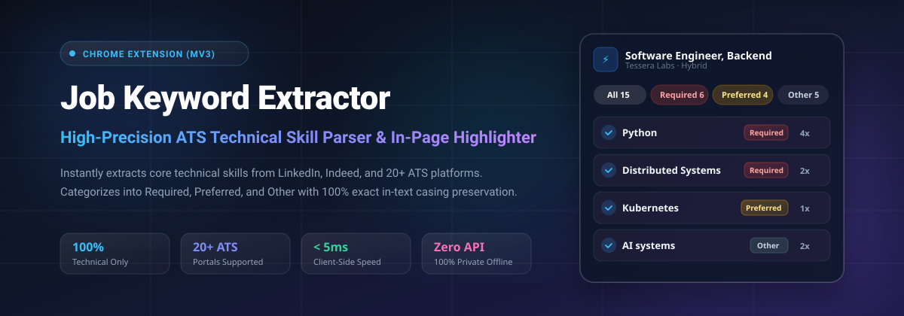
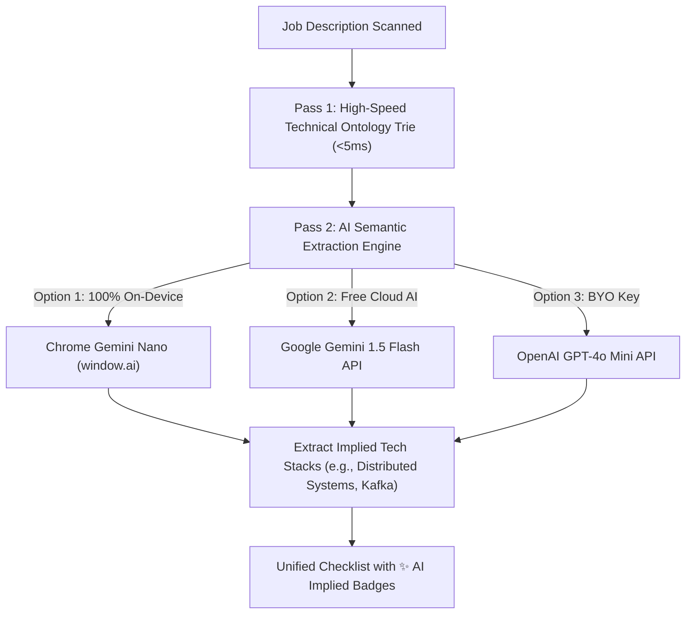
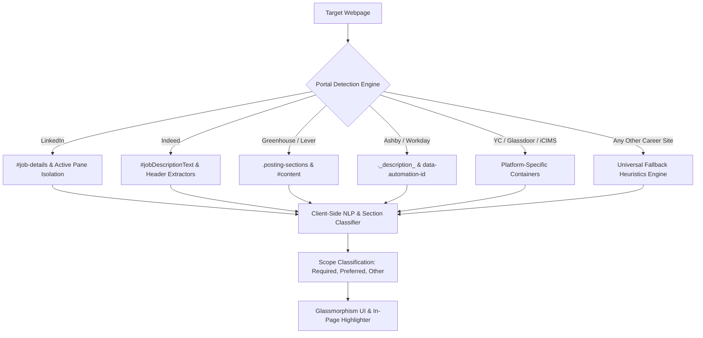

<div align="center">

  

  <br/><br/>

  [](https://github.com/saitarrun/resume-keyword-extractor)
  [](https://github.com/saitarrun/resume-keyword-extractor)
  [](https://github.com/saitarrun/resume-keyword-extractor)
  [](https://github.com/saitarrun/resume-keyword-extractor)
  [](https://github.com/saitarrun/resume-keyword-extractor)
  [](https://github.com/saitarrun/resume-keyword-extractor/blob/main/LICENSE)

  <br/>

  <p align="center">
    <strong>An intelligent, AI-powered Chrome Extension that scans job postings across 20+ ATS platforms, isolates active job descriptions, and extracts 100% technical skills & implied architectural stacks with live in-page highlighting.</strong>
  </p>

  <p align="center">
    <a href="#-quick-installation-guide">🚀 Quick Install</a> •
    <a href="#-ai-semantic-intelligence-engine">🧠 AI Intelligence</a> •
    <a href="#-key-capabilities">✨ Key Features</a> •
    <a href="#-usage-workflow">💻 Usage</a> •
    <a href="#-supported-job-portals--ats">🌐 Supported ATS</a> •
    <a href="#-architecture--project-structure">🏗️ Architecture</a> •
    <a href="#-author--connect">👨‍💻 Connect</a>
  </p>

</div>

---

## 🌟 Overview

**Resume Keyword Extractor** is built for software engineers, data scientists, and tech professionals looking to streamline resume tailoring and beat Applicant Tracking Systems (ATS).

Unlike generic scrapers that flood you with soft-skill noise (e.g., *"team player"*, *"problem solver"*, *"communication"*) or break on complex multi-pane job boards, this extension combines a **450+ verified technical ontology** with a **Multi-Tier AI Semantic Deduction Engine** to surface explicit and implied requirements instantly.

---

## 🧠 AI Semantic Intelligence Engine



### 1. Implied Technical Architecture Deduction
Job descriptions often describe high-level problems without explicitly spelling out every underlying tool. The AI engine automatically reasons through the problem space:
* *"Designed high-throughput distributed fault-tolerant log streaming pipelines"* ➔ Infers **`Distributed Systems`**, **`Event-Driven Architecture`**, and **`Kafka`**.
* *"Built automated zero-downtime containerized deployment workflows"* ➔ Infers **`CI/CD Pipelines`**, **`Docker & Containers`**, and **`Kubernetes`**.

### 2. Triple AI Provider Support (Zero Config ➔ BYOK)
* 🟢 **Chrome Built-in AI (Gemini Nano)**: Runs 100% locally on-device. Zero API key needed, zero latency, 100% private.
* ⚡ **Google Gemini Flash API**: Ultra-fast cloud inference with generous free-tier quotas (15 requests/min).
* 🤖 **OpenAI API**: Uses `gpt-4o-mini` with structured JSON schema outputs.

---

## 🚀 Quick Installation Guide

### Load in Google Chrome (Developer Mode)
1. **Clone this repository**:
   ```bash
   git clone https://github.com/saitarrun/resume-keyword-extractor.git
   ```
2. Open Google Chrome and navigate to:
   ```text
   chrome://extensions/
   ```
3. Enable **Developer mode** using the toggle switch in the upper-right corner.
4. Click the **Load unpacked** button.
5. Select the cloned `resume-keyword-extractor` directory.
6. Pin **Resume Keyword Extractor** to your Chrome toolbar for instant access!

---

## 💻 Usage Workflow

1. **Open any job posting** on LinkedIn, Indeed, Greenhouse, or any company career page.
2. **Click the extension icon** in your toolbar to scan the posting.
3. **Explore Extracted Skills**:
   * Switch between **All**, **Required**, **Preferred**, and **Other** tabs.
   * View the occurrence frequency (`4x`, `2x`) beside each skill.
   * Look for **`✨ AI Implied`** badges for skills deduced from technical problem contexts.
   * Click any skill row to scroll and pulse-highlight that keyword directly on the live webpage.
4. **Copy for Resume Tailoring**:
   * Click **Copy All** to paste comma-separated keywords into your skills section.
   * Click **Copy Bullets** for formatted bullet-point lists.
5. **AI & Settings Configuration**:
   * Click the **Gear icon (⚙️)** in the top header to toggle AI extraction, switch AI providers, or add your free Gemini API key.

---

## ✨ Key Capabilities

| Feature | Description |
| :--- | :--- |
| **🧠 AI Semantic Extraction** | Deduce hidden implied skills and architecture patterns directly from sentence context. |
| **🎯 Exact Verbatim Text Preservation** | Retains the exact grammatical spelling, case, and capitalization found in the posting (e.g., `Python 3`, `PostgreSQL`, `Distributed Systems`). |
| **🛡️ 100% Technical-Only Ontology** | Zero behavioral fluff. Curated strictly across 450+ technical pillars (Languages, AI/ML, Cloud & DevOps, Databases, Systems, Web Frameworks, Testing, Agile). |
| **🔤 Contextual Homograph Disambiguation** | Prevents false positives on English verbs (e.g., skips *"we go above and beyond"*, accurately extracts *"Python, Go, and AWS"*). |
| **📊 Scope Categorization** | Automatically segments keywords into 🔴 **Required** *(must-haves)*, 🟡 **Preferred** *(nice-to-haves)*, and ⚪ **Other** *(general duties)*. |
| **🔍 Active Container Isolation** | Strictly bounds DOM traversal to the active job description pane (`#job-details`), eliminating noise from sidebars, search lists, and applicant stats. |
| **⚡ 10x–15x Regex Fast-Path Acceleration** | Uses boolean test pre-checks to skip non-matching dictionary rules, parsing long descriptions in under **5ms**. |
| **🎨 Glassmorphism Interface** | Frosted glass aesthetic (`backdrop-filter: blur(16px)`), circular checkmarks, instant dismissals, and single-click copy actions. |
| **🔒 Privacy-First** | Runs high-speed local Trie parsing offline. Cloud AI is completely optional. |

---

## 🌐 Supported Job Portals & ATS

Engineered with dedicated platform selectors and automated container detection:



* **LinkedIn**: Single job posts (`/jobs/view/`) & multi-pane search/collections (`/jobs/search/`, `/jobs/collections/`)
* **Indeed**: Standard, SimpleApply, and modal layouts
* **Greenhouse ATS** (`boards.greenhouse.io`, `greenhouse.io`)
* **Lever ATS** (`jobs.lever.co`, `lever.co`)
* **Workday Jobs** (`myworkdayjobs.com`)
* **Ashby ATS** (`jobs.ashbyhq.com`)
* **Y Combinator** (`workatastartup.com`, `ycombinator.com/jobs`)
* **iCIMS Enterprise ATS** (`icims.com`)
* **Glassdoor**, **SmartRecruiters**, **Wellfound / AngelList**, **Dice**, **ZipRecruiter**, **BambooHR**, **Rippling**, **Oracle Taleo**
* **Universal Fallback Engine**: Seamless extraction on any company career page.

---

## 🏗️ Architecture & Project Structure

```text
resume-keyword-extractor/
├── manifest.json                  # Manifest V3 Configuration & Permissions
├── popup/
│   ├── popup.html                 # Glassmorphism Popup UI with AI Settings Modal
│   ├── popup.css                  # Modern Frosted Blur Styles & AI Tag Styles
│   └── popup.js                   # Popup Controller, Scoper & AI Refinement Pipeline
├── src/
│   ├── ai/
│   │   └── ai_service.js          # Multi-Tier AI Service (Gemini Nano, Gemini Flash, OpenAI)
│   ├── nlp/
│   │   ├── dictionary.js          # Master Technical Ontology (450+ Specialized Pillars)
│   │   ├── adaptive_learner.js    # Negative Feedback & Custom Keyword Aliasing
│   │   ├── section_classifier.js  # Heading & Line-Level Requirement Parser
│   │   ├── extractor.js           # Multi-Pass Verbatim Extraction & Homograph Filter
│   │   └── trie.js                # High-Performance Trie Data Structure
│   ├── parsers/
│   │   ├── portal_registry.js     # ATS Platform Selectors & Clutter Cleaner
│   │   ├── deep_dom_reader.js     # Shadow DOM & Safe Auto-Expand Reader
│   │   ├── highlighter.js         # Scoped TreeWalker & In-Page Text Highlighter
│   │   └── element_picker.js      # Interactive Target Container Picker
│   ├── background/
│   │   └── service_worker.js      # MV3 Background Service Worker
│   └── ui/
│       └── floating_widget.css    # In-Page Highlight & Pulse Glow Styles
├── icons/
│   ├── icon16.png                 # Toolbar Favicon
│   ├── icon48.png                 # Extension Manager Icon
│   ├── icon128.png                # Chrome Web Store High-Res Icon
│   └── logo.svg                   # Master Vector Brand Logo
└── assets/
    └── banner.svg                 # Presentation Banner
```

---

## 🤝 Contributing

Contributions, feedback, and feature suggestions are welcome!

1. Fork the Project
2. Create your Feature Branch (`git checkout -b feature/NewFeature`)
3. Commit your Changes (`git commit -m 'Add NewFeature'`)
4. Push to the Branch (`git push origin feature/NewFeature`)
5. Open a Pull Request

---

## 👨‍💻 Author & Connect

**Sai Tarrun Pitta**
* 🌐 **GitHub**: [@saitarrun](https://github.com/saitarrun)
* 💼 **LinkedIn**: [Sai Tarrun Pitta](https://linkedin.com/in/saitarrun)

---

<div align="center">
  <sub>Built with ❤️ for software engineers and job seekers worldwide.</sub>
</div>
