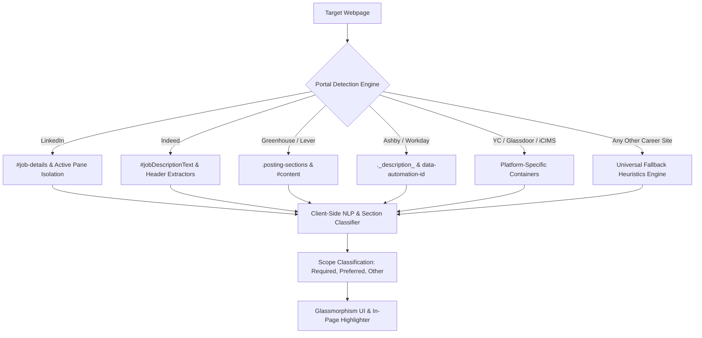

<div align="center">

  

  <br/><br/>

  [](https://github.com/saitarrun/resume-keyword-extractor)
  [](https://github.com/saitarrun/resume-keyword-extractor)
  [](https://github.com/saitarrun/resume-keyword-extractor)
  [](https://github.com/saitarrun/resume-keyword-extractor)
  [](https://github.com/saitarrun/resume-keyword-extractor/blob/main/LICENSE)

  <br/>

  <p align="center">
    <strong>An intelligent, privacy-first Chrome Extension that parses job descriptions, isolates active postings, and extracts 100% technical skills classified into Required, Preferred, and Other with live in-page highlighting.</strong>
  </p>

  <p align="center">
    <a href="#quick-installation-guide">🚀 Quick Install</a> •
    <a href="#key-capabilities">✨ Key Features</a> •
    <a href="#usage-workflow">💻 Usage</a> •
    <a href="#supported-job-portals--ats">🌐 Supported ATS</a> •
    <a href="#architecture--engineering-highlights">🏗️ Architecture</a> •
    <a href="#author--connect">👨‍💻 Connect</a>
  </p>

</div>

---

## 🌟 Overview

**Resume Keyword Extractor** is built for software engineers, data scientists, and tech professionals looking to streamline resume tailoring and application optimization.

Unlike generic parsers that flood users with soft skills (e.g., *"team player"*, *"problem solver"*) or break on complex multi-pane job boards, this extension employs a **100% technical ontology** and **deep DOM container isolation** to surface the exact languages, frameworks, cloud tools, databases, and architectures recruiters and ATS screeners look for.

---

## 🚀 Quick Installation Guide

### Load in Google Chrome (Developer Mode)
1. **Clone this repository**:
   ```bash
   git clone https://github.com/saitarrun/resume-keyword-extractor.git
   ```
2. Open Google Chrome and navigate to:
   ```text
   chrome://extensions/
   ```
3. Enable **Developer mode** using the toggle switch in the upper-right corner.
4. Click the **Load unpacked** button.
5. Select the cloned `resume-keyword-extractor` folder.
6. Pin **Resume Keyword Extractor** to your Chrome toolbar for instant 1-click access!

---

## 💻 Usage Workflow

1. **Open any job posting** on LinkedIn, Indeed, Greenhouse, or any ATS site.
2. **Click the extension icon** in your toolbar to scan the posting.
3. **Explore Extracted Skills**:
   * Switch between **All**, **Required**, **Preferred**, and **Other** tabs.
   * View the mention frequency (`4x`, `2x`) beside each skill.
   * Click any skill row to scroll and pulse-highlight that keyword directly on the live webpage.
4. **Copy for Resume Tailoring**:
   * Click **Copy (Comma-Separated)** to paste into your resume skills section.
   * Click **Copy (Bullets)** for formatted bullet-point lists.
5. **Add Custom Keywords**: Type any proprietary tool or library into the custom keyword input and press **Enter**.

---

## ✨ Key Capabilities

| Feature | Description |
| :--- | :--- |
| **🎯 Exact Verbatim Text Preservation** | Retains the exact grammatical spelling, case, and capitalization found in the posting (e.g., `Python 3`, `PostgreSQL`, `Distributed Systems`). |
| **🛡️ 100% Technical-Only Ontology** | Zero behavioral fluff. Curated strictly across Languages, AI/ML, Cloud & DevOps, Databases, Systems, Web Frameworks, and Protocols. |
| **📊 Precise Scope Categorization** | Automatically segments keywords into 🔴 **Required** *(must-haves)*, 🟡 **Preferred** *(nice-to-haves/bonus)*, and ⚪ **Other** *(general duties)*. |
| **🔢 1-to-1 Match Frequency Counter** | Counts the exact occurrence frequency of each term on the live page (e.g. `4x`, `2x`), matching what you see on the screen. |
| **🔍 Active Posting Container Isolation** | Strictly bounds DOM traversal to the active job description pane (`#job-details`), eliminating noise from sidebars, search lists, and applicant stats. |
| **⚡ 10x–15x Regex Fast-Path Acceleration** | Uses boolean test pre-checks to skip non-matching dictionary rules, parsing long descriptions in under **5ms**. |
| **🎨 Modern Glassmorphism Interface** | Frosted glass aesthetic (`backdrop-filter: blur(16px)`), circular checkmarks, instant dismissals, and single-click copy actions. |
| **🔒 100% Offline & Private** | Zero external API calls, zero telemetry. All NLP and DOM traversal runs locally in your browser session. |

---

## 🌐 Supported Job Portals & ATS

Engineered with platform-specific selectors and automated container detection:



* **LinkedIn**: Single job posts (`/jobs/view/`) & multi-pane search/collections (`/jobs/search/`, `/jobs/collections/`)
* **Indeed**: Standard, SimpleApply, and modal layout
* **Greenhouse ATS** (`boards.greenhouse.io`, `greenhouse.io`)
* **Lever ATS** (`jobs.lever.co`, `lever.co`)
* **Workday Jobs** (`myworkdayjobs.com`)
* **Ashby ATS** (`jobs.ashbyhq.com`)
* **Y Combinator** (`workatastartup.com`, `ycombinator.com/jobs`)
* **iCIMS Enterprise ATS** (`icims.com`)
* **Glassdoor**, **SmartRecruiters**, **Wellfound / AngelList**, **Dice**, **ZipRecruiter**
* **Universal Fallback Engine**: Seamless extraction on any company career site.

---

## 🏗️ Architecture & Engineering Highlights

```text
resume-keyword-extractor/
├── manifest.json                  # Manifest V3 Configuration
├── popup/
│   ├── popup.html                 # Glassmorphism Popup Interface
│   ├── popup.css                  # Modern UI Styles & Translucent Blur Filters
│   └── popup.js                   # Popup Controller, Scoper & Clipboard Engine
├── src/
│   ├── nlp/
│   │   ├── dictionary.js          # Strictly Technical Ontology (280+ pillars)
│   │   ├── section_classifier.js  # Heading & Line-Level Requirement Parser
│   │   ├── extractor.js           # Multi-Pass Verbatim Extraction Engine
│   │   └── trie.js                # High-Performance Trie Data Structure
│   ├── parsers/
│   │   ├── portal_registry.js     # ATS Platform Selectors & Rule Registry
│   │   ├── deep_dom_reader.js     # Shadow DOM & Safe Auto-Expand Reader
│   │   ├── highlighter.js         # Scoped TreeWalker & Live Text Highlighter
│   │   └── element_picker.js      # Custom Target Container Inspector
│   └── background/
│       └── service_worker.js      # MV3 Background Service Worker
└── assets/
    └── banner.svg                 # Brand & Presentation Banner
```

---

## 🤝 Contributing

Contributions, feedback, and feature suggestions are welcome!

1. Fork the Project
2. Create your Feature Branch (`git checkout -b feature/NewFeature`)
3. Commit your Changes (`git commit -m 'Add NewFeature'`)
4. Push to the Branch (`git push origin feature/NewFeature`)
5. Open a Pull Request

---

## 👨‍💻 Author & Connect

**Sai Tarrun Pitta**
* 🌐 **GitHub**: [@saitarrun](https://github.com/saitarrun)
* 💼 **LinkedIn**: [Sai Tarrun Pitta](https://linkedin.com/in/saitarrun)

---

<div align="center">
  <sub>Built with ❤️ for software engineers and job seekers worldwide.</sub>
</div>
